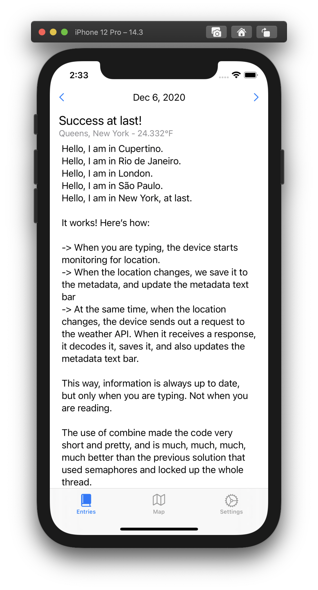
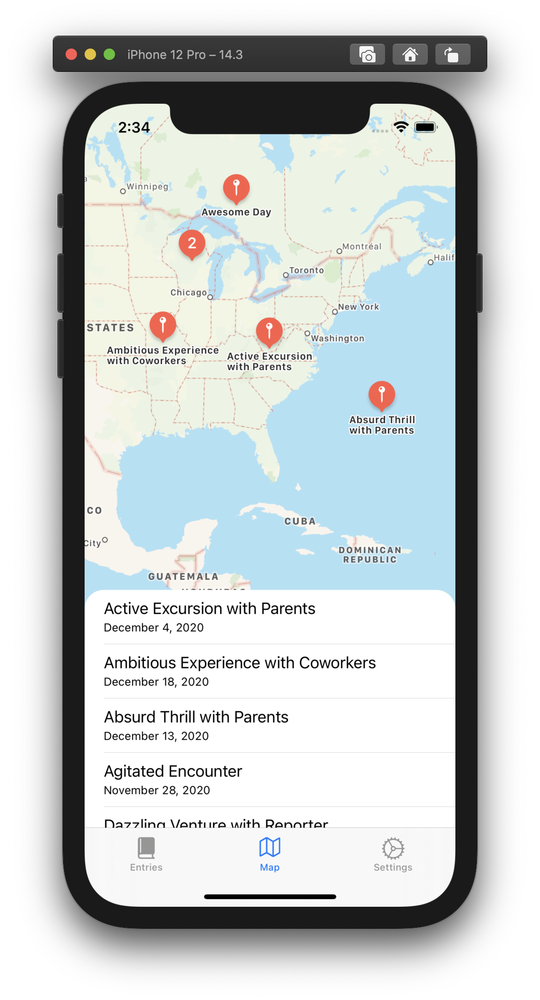
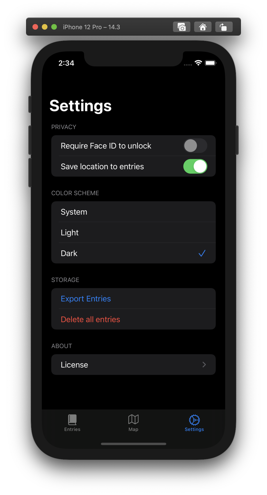

# Daily
Daily is a simple diary and life-logging app. Just open the app and write down your thoughts. It's that simple. When you want, go back in time, and see how each day was like. You can't modify past logs, but it's fun to read them.

## Pages
- **Entries:** write the entry for the current day, see your past thoughts day by day
- **Maps:** see where you wrote each entry, browsing through the friendly map interface
- **Settings:** enable & disable location tracking, facial unlocking & export your entries

## Technologies
Daily leverages a range of powerful technologies to provide a seamless user experience:

* **UIKit**: The majority of the app is built using UIKit, with a focus on programmatic UI creation. This approach enables flexibility and control over the app's interface, utilizing UIStackViews, UILabels, and UITextViews to deliver an optimal user experience.
* **SwiftUI**: The Settings page is developed using SwiftUI, an intuitive framework that simplifies UI development. With SwiftUI, setting up and managing UserDefaults becomes effortless, enhancing the user's customization options.
* **CoreData**: To store data efficiently, Daily utilizes the CoreData framework. CoreData provides a flexible and fast storage solution, allowing seamless retrieval and management of your entries.
* **MapKit**: The Map view integrates with Apple's MapKit package, enabling users to visualize the locations where their entries were created. This feature adds a spatial element to your diary, enhancing the overall experience.
* **OpenWeatherMap API**: Daily utilizes the OpenWeatherMap API (available at https://openweathermap.org) to provide weather information. 

## Preview

## Advanced Flags
When running the project from Xcode, the following flags are available:
| Flag                         | Description                                                                                                 |
|------------------------------|-------------------------------------------------------------------------------------------------------------|
| --enable-biometric-locking   | enables the option to lock the app when it enters the background, requiring Face ID or Touch ID to unlock.  |
| --reset-user-preferences     | deletes all the UserDefaults user preferences, adjustable in the settings page.                             |
| --always-enable-location     | makes sure the app always attempts to log the location (disables preference in settings page)               |
| --activate-biometric-locking | activates biometric locking & unlocking, regardless of the user preference                                  |
| --reset-today-entry          | removes the entries from the current day                                                                    |

## License
This project is licensed under the [MIT License](LICENSE).
