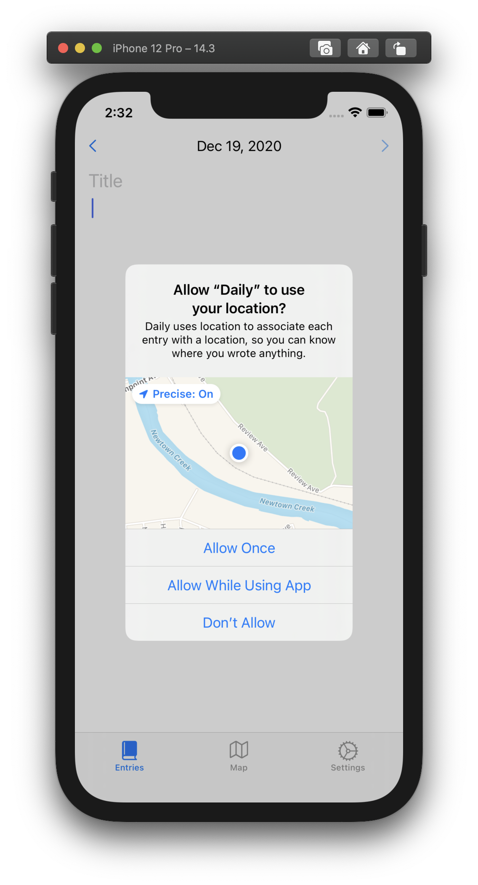

# Daily
Daily is a simple diary and life-logging app. Just open the app and write down your thoughts. It's that simple. When you want, go back in time, and see how each day was like. You can't modify past logs, but it's fun to read them.

## Pages
- **Entries:** write the entry for the current day, see your past thoughts day by day
- **Maps:** see where you wrote each entry, browsing through the friendly map interface
- **Settings:** enable & disable location tracking, facial unlocking & export your entries

## Technologies
The majority of the app is made using UIKit code. There are no storyboards, only programatically created `UIStackView`s, `UILabel`s, `UITextView`s and the like. Aditionally, the Settings page is made with SwiftUI, because it is ridiculously easy to setup, and UserDefaults are managed automagically for you. To store data, the app uses the `CoreData` framework, which is flexible and fast. The Map view is part of the `MapKit` package from Apple.

## External sources
The app uses an external API from <https://openweathermap.org> which is very easy to use. This can be disabled by simply denying outgoing connections (simulator) or disabling WiFi and Cellular connectivity (physical devices).

## Flags
When running the project from Xcode, the following flags are available:
| Flag                         | Description                                                                                                 |
|------------------------------|-------------------------------------------------------------------------------------------------------------|
| --enable-biometric-locking   | enables the option to lock the app when it enters the background, requiring Face ID or Touch ID to unlock.  |
| --reset-user-preferences     | deletes all the UserDefaults user preferences, adjustable in the settings page.                             |
| --always-enable-location     | makes sure the app always attempts to log the location (disables preference in settings page)               |
| --activate-biometric-locking | activates biometric locking & unlocking, regardless of the user preference                                  |
| --reset-today-entry          | removes the entries from the current day                                                                    |

## Images

## License
This project is licensed under the [MIT License](LICENSE).
